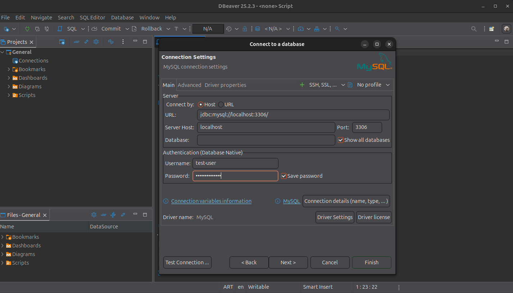

### Instalar Docker
Instalar dependencias y añadir clave GPG
```bash
sudo apt-get update
sudo apt-get install ca-certificates curl gnupg
sudo install -m 0755 -d /etc/apt/keyrings
curl -fsSL https://download.docker.com/linux/ubuntu/gpg | sudo gpg --dearmor -o /etc/apt/keyrings/docker.gpg
sudo chmod a+r /etc/apt/keyrings/docker.gpg
```
Añadir repositorio de Docker
```bash
echo "deb [arch=$(dpkg --print-architecture) signed-by=/etc/apt/keyrings/docker.gpg] https://download.docker.com/linux/ubuntu $(. /etc/os-release && echo "$VERSION_CODENAME") stable" | sudo tee /etc/apt/sources.list.d/docker.list > /dev/null
```
Actualizar lista de paquetes
```bash
sudo apt-get update
```
Instalar Docker Engine
```bash
sudo apt-get install docker-ce docker-ce-cli containerd.io docker-buildx-plugin docker-compose-plugin
```
Añadir user al gurpo docker y aplicar cambios
```bash
sudo usermod -aG docker $USER
newgrp docker
```
Verificar Instalación
```bash
docker run hello-world
```
Si la instalación fue exitosa, verá un mensaje de confirmación en su terminal. 

---
### Variables de entorno
Crear un archivo `.env`
```bash
touch .env
```
Y escribirle las siguientes variables de entorno (reemplazando los tres puntos)
```bash
MYSQL_USER=...
MYSQL_PASSWORD=...
MYSQL_DATABASE=...
MYSQL_PORT=3306
MYSQL_ROOT_PASSWORD=...
```
---
### Ejecutar el servicio
Correr en la terminal el siguiente comando:
```bash
docker run -d \
  --name servicio-mysql \
  --env-file .env \
  -v $(pwd)/tablas.sql:/docker-entrypoint-initdb.d/tablas.sql \
  -v mysql_data:/var/lib/mysql \
  -p 3306:3306 \
  mysql:8.4
```
Corroborar que el contenedor se está ejecutando
```bash
docker ps
```


---

### Consumir servicio
Nos podemos conectar al MySQL con cualquier cliente de base de datos, por ejemplo DBeaver.

Creamos una conexión nueva, seleccionamos MySQL y en username y password ponemos las credenciales que hayamos puesto en las variables de entorno `MYSQL_USER` y `MYSQL_PASSWORD` y apretamos Finish. 


Hacemos `click derecho en la base de datos > SQL Editor > Open SQL script` y ya podemos escribir consultas a la base de datos


Por ejemplo:
